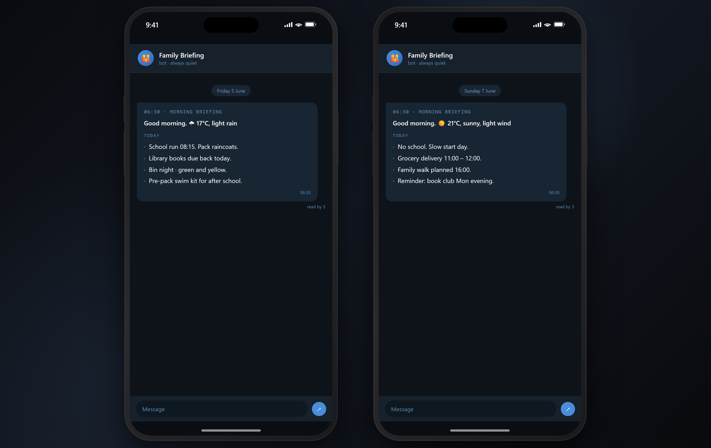
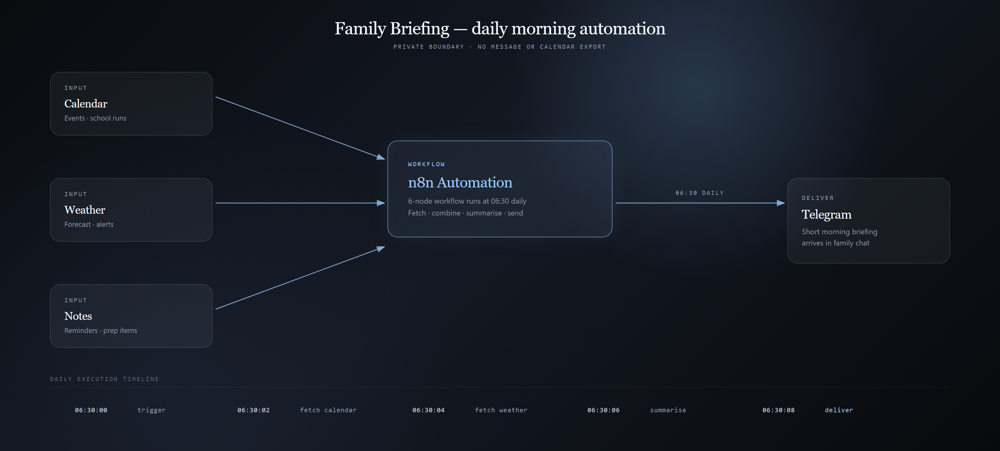

# Family Briefing

A small morning automation that sends my family one short message each day with what's coming up, so we stop forgetting the little things.

## Why I built it

Between family, work, sport, and normal logistics, it's easy to forget something. My wife and I keep a shared calendar where we both add appointments, school items, travel prep, car servicing, and anything that needs doing before it becomes stressful.

So I built a morning briefing. Every day, our family assistant "Mrs Maggie" sends a short Telegram message with today's and tomorrow's events, plus a simple weather reminder like grabbing an umbrella if rain is likely. One quick message at the moment it's most useful, instead of both of us checking the calendar.

## What it does

- Reads our shared family calendar for today's and tomorrow's events.
- Adds a simple weather reminder when it's relevant.
- Writes it up as one short, friendly message.
- Sends it to our family Telegram chat every morning.
- Runs on its own, on a schedule, with nothing to check by hand.

## Screenshots and workflow

The morning Telegram briefing, using demo events and weather.

The flow: gather calendar and weather, shape the message, send it to Telegram.

## How it works

The whole thing runs as an automation built in n8n. On a morning schedule it gathers the calendar events and weather, turns them into one short and readable message, and delivers it to our family chat. It's meant to be practical and quiet, not another app to open.

## Privacy

This public repo uses demo content only. Our real calendar, messages, family details, and chat are private and are not included here.

## Built with AI assistance

I'm not a software developer. I spotted the everyday problem, decided how the briefing should read, and used AI and automation tools to help build it. The point is reducing forgotten logistics with one small, reliable habit.

## Related

- Portfolio: https://www.mikhailnarbekov.com
- Medium story: coming soon
- GitHub: https://github.com/Mnarbekov
